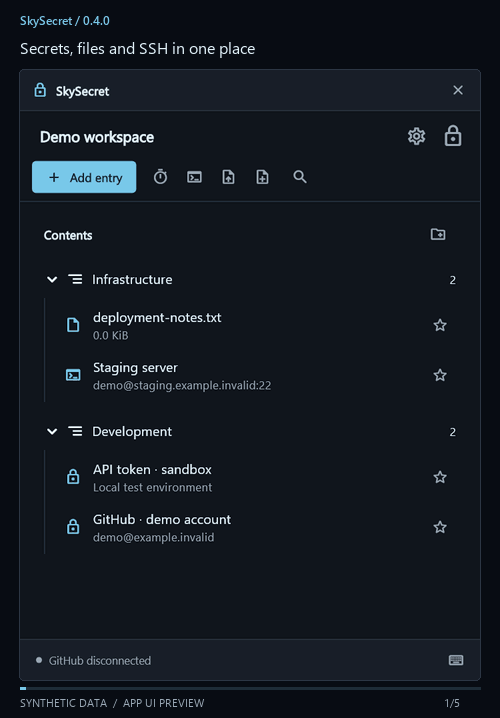
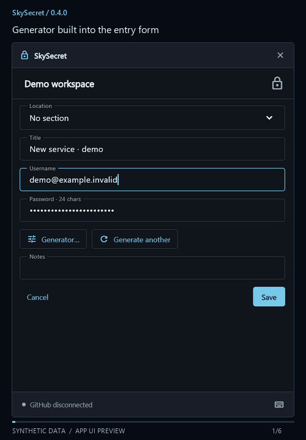

# SkySecret
SkySecret (Sky Secret)

**A private workflow for secrets, files and SSH on Windows.**

[Русский](#русский) · [Download](https://github.com/Skyonave/sky_secret/releases) · [Security](SECURITY.md)

Local first, offline, one portable EXE. **Shift+Space → your vault → back to work.** SkySecret focuses on daily work with secrets; it is not intended as a KeePass replacement.

## Available now

- **Encrypted vaults:** passwords, notes, files, SSH and TOTP. Multiple vaults, folders and favorites.
- **Desktop controls:** compact tray window, search with **F**, right-click menus and **Ctrl+S** in editors.
- **Drag files both ways:** into the vault, or onto the desktop / File Explorer to export a copy. Exported copies are unencrypted.
- **Text editing:** create `.txt` files and edit text in separate windows.
- **Generator inside entries:** passwords, English passphrases, character rules and saved settings.
- **Backup and sync:** encrypted `.smv` import/export, local history, optional GitHub backups and manual synchronization with conflict review.
- **Quick actions:** copy secrets, use TOTP tiles and start saved SSH connections through Windows OpenSSH.

### Preview · synthetic data

| Vault workflow | Passwords and passphrases |
| --- | --- |
|  |  |

## Start

Download the EXE from **Releases**, run it, open the tray window and create a vault. **There is no master-password reset.** GitHub is optional. Keep verified independent backups.

Save edits before hiding: hiding locks the vault by default. Completed copies remain available for **10 seconds from copying**, including after hiding. Manual, idle and Windows locks clear the app's current copy immediately. Existing vaults remain readable; update all clients before saving a shared vault with a newer version.

> We work to protect your data, but cannot guarantee its security or recovery. [Protection and limits](SECURITY.md).

## Next: Projects

**Planned; not included in 0.4.0.** Project = a dedicated encrypted vault + project secrets + an unlock policy.

- **Unlock with workspace:** use the workspace's shared master-password policy.
- **Require separate master password:** keep sensitive work or infrastructure projects separately locked.
- Each project should have its own data key, lock state, timeout, history, export and sync. A shared unlock policy does not mean a shared data key.

Next workflow: **Project → secrets → `.env` → run command**. Later: select the relevant project from context when opening **Shift+Space**. Windows Hello, hardware keys and session re-authentication are possible policy extensions, not implemented features or scheduled releases.

## Русский

**Приватный рабочий процесс для секретов, файлов и SSH на Windows.**

Локальные данные, работа без интернета, один переносимый EXE. **Shift+Space → сейф → нужное действие.** SkySecret развивается вокруг повседневной работы с секретами, а не как замена KeePass.

### Уже работает

- **Зашифрованные сейфы:** пароли, заметки, файлы, SSH и TOTP. Несколько сейфов, папки и избранное.
- **Desktop-интерфейс:** компактное окно у трея, поиск по **F**, контекстные меню и **Ctrl+S** в редакторах.
- **Перетаскивание в обе стороны:** добавление файлов в сейф и экспорт копии на рабочий стол или в Проводник. Внешняя копия не зашифрована.
- **Текстовые файлы:** создание `.txt` и редактирование текста в отдельных окнах.
- **Генератор в записи:** пароли, английские парольные фразы, выбор символов и сохранение настроек.
- **Копии и синхронизация:** импорт/экспорт `.smv`, локальная история, необязательный GitHub и ручная синхронизация с разбором конфликтов.
- **Быстрые действия:** копирование секретов, отдельные плашки TOTP и подключения через Windows OpenSSH.

### Начать

Скачайте EXE из **Releases**, запустите, откройте окно из трея и создайте сейф. **Сброса мастер-пароля нет.** GitHub подключается по желанию. Храните проверенные независимые копии.

Сохраняйте правки перед скрытием: по умолчанию оно блокирует сейф. Завершённое копирование доступно **10 секунд с момента копирования**, включая время после скрытия. Ручная блокировка, тайм-аут и блокировка Windows сразу очищают текущую копию приложения. Ранее созданные сейфы читаются; перед сохранением общего сейфа в новой версии обновляйте все устройства.

> Мы максимально стараемся обезопасить данные, но не можем гарантировать их безопасность и восстановление. [Защита и её границы](SECURITY.md).

### Ближайшее обновление: Projects

**В планах; в 0.4.0 ещё нет.** Project = отдельный зашифрованный сейф + секреты проекта + политика открытия.

- **Открывать вместе с workspace:** общая политика мастер-пароля рабочего пространства.
- **Требовать отдельный мастер-пароль:** чувствительный рабочий проект или инфраструктура открываются отдельно.
- У каждого проекта планируются собственные ключ данных, блокировка, тайм-аут, история, экспорт и синхронизация. Общая политика открытия не означает общий ключ шифрования.

Следующий сценарий: **Проект → секреты → `.env` → запуск команды**. Затем — выбор проекта по контексту при вызове **Shift+Space**. Windows Hello, аппаратные ключи и повторное подтверждение сессии рассматриваются как расширения политики; они пока не реализованы и не имеют срока выпуска.

---

Passphrases: [EFF Long Wordlist](https://www.eff.org/dice), Joseph Bonneau / Electronic Frontier Foundation, [CC BY 4.0](https://creativecommons.org/licenses/by/4.0/). [Attribution / источник](assets/wordlists/NOTICE.txt) · [License](LICENSE)
