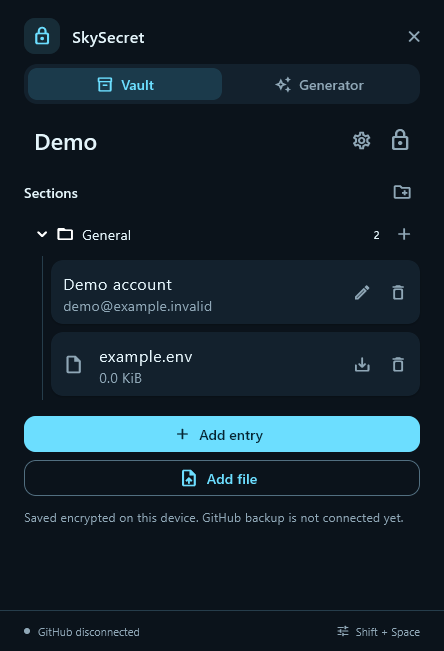
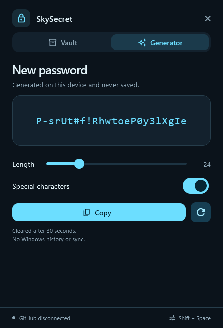

# SkySecret

[Русский](#русский) · [Releases](https://github.com/Skyonave/sky_secret/releases)

A portable password and file manager for Windows. Works offline, lives in the system tray and opens with **Shift+Space**. Built with Flutter and Dart.

  
  

- Multiple vaults with separate master passwords, **Argon2id + AES-256-GCM** encryption, password generation and automatic locking.
- Secrets and files organized into sections and folders, with drag-and-drop and saved manual ordering.
- Open the manager with **Shift+Space**, unlock your vault, then press **F** to open search in the center of the screen. Type a name, username, server or folder; choose a suggestion with **↑/↓ + Enter** or a click. **Esc** closes search. Mark favorites with a star. Deleted entries go to encrypted trash and can be restored; **Undo** is available immediately after deletion.
- Create `.txt` files in the vault and edit text in separate windows; **Ctrl+S** saves changes.
- Saved SSH connections through CMD and Windows OpenSSH.
- Encrypted `.smv` import/export, optional GitHub backups and manual sync, conflict review, history and recovery.
- Russian and English interface; configurable visibility in screen recordings.
- Verification codes (TOTP): choose **Add authenticator**, enter a name and paste the setup key or `otpauth://` link. Codes appear as separate tiles beside the manager, aligned at the bottom and growing upward. Click a tile to copy; use the wheel or arrows for more codes. Click an authenticator entry to open the tiles again; Esc hides them. Codes work offline; keep the computer clock accurate. Delete the authenticator entry to remove it. QR import is not supported.

Run **SkySecret-<version>-windows-x64.exe**, open the manager from the tray and create a vault. **There is no master-password reset.** GitHub is optional; its connection dialog guides repository and token setup. Save edits before hiding the manager: hiding locks it by default.

> We work to protect your data, but cannot guarantee its security or recovery. Keep verified independent backups.

Before saving a shared vault in **0.3.1**, update every device to **0.3.1 or later**. Older versions cannot open the updated vault. Keep a verified independent backup before upgrading.

Previously created vaults remain readable, including TOTP stored with a password or SSH entry. These existing records keep their fields when saved. New authenticators use a separate entry type.

Adding TOTP requires this authenticator-capable build on every device: the original **0.3.1** release cannot open vaults containing TOTP. Authenticator keys are encrypted with the vault and included in its exports and backups. Keeping passwords and authenticator keys together means access to the unlocked vault exposes both.

## Русский

Переносной менеджер паролей и файлов для Windows. Работает офлайн, запускается в трее и открывается по **Shift+Space**. Написан на Flutter и Dart.

- Несколько сейфов с отдельными мастер-паролями, шифрование **Argon2id + AES-256-GCM**, генератор паролей и автоблокировка.
- Секреты и файлы в разделах и папках, перетаскивание и сохранение ручного порядка.
- Откройте менеджер через **Shift+Space**, разблокируйте сейф и нажмите **F** — поиск появится в центре экрана. Введите название, логин, сервер или папку; выберите подсказку стрелками **↑/↓ + Enter** или мышью. **Esc** закрывает поиск. Звезда добавляет запись в избранное. Удалённые записи можно восстановить из зашифрованной корзины; сразу после удаления доступно **«Отменить»**.
- Создание `.txt` внутри сейфа, редактирование текста в отдельных окнах; **Ctrl+S** сохраняет изменения.
- Сохранённые SSH-подключения через CMD и Windows OpenSSH.
- Импорт и экспорт зашифрованных `.smv`, необязательные копии в GitHub и ручная синхронизация, разбор конфликтов, история и восстановление.
- Русский и английский интерфейс, настройка видимости при записи экрана.
- Коды подтверждения (TOTP): выберите **«Добавить аутентификатор»**, укажите название и ключ настройки или ссылку `otpauth://`. Коды появляются отдельными плашками рядом с менеджером, от нижнего края вверх. Нажатие копирует код; колесо и стрелки листают остальные записи. Нажатие на запись аутентификатора снова открывает плашки, Esc скрывает их. Интернет не нужен; часы компьютера должны быть точными. Для удаления используйте корзину записи аутентификатора. Импорт QR не поддерживается.

Запустите **SkySecret-<версия>-windows-x64.exe**, откройте менеджер из трея и создайте сейф. **Сброса мастер-пароля нет.** GitHub подключается по желанию; настройка репозитория и токена объясняется в диалоге подключения. Сохраняйте правки перед скрытием: по умолчанию оно блокирует сейф.

> Мы максимально стараемся обезопасить данные, но не можем гарантировать их безопасность и восстановление. Храните проверенные независимые резервные копии.

Перед сохранением общего сейфа в **0.3.1** обновите все устройства до **0.3.1 или новее**. Старые версии не откроют обновлённый сейф. До обновления сохраните проверенную независимую резервную копию.

Ранее созданные сейфы открываются, включая TOTP внутри записи пароля или SSH. При сохранении такие записи сохраняют свои поля. Новые аутентификаторы создаются отдельным типом.

Для TOTP установите эту сборку с поддержкой кодов на все устройства: исходный релиз **0.3.1** не откроет сейф с TOTP. Ключи аутентификатора зашифрованы вместе с сейфом и входят в его экспорт и резервные копии. При совместном хранении паролей и ключей доступ к открытому сейфу раскрывает оба.

[Security / Безопасность](SECURITY.md) · [License](LICENSE)
